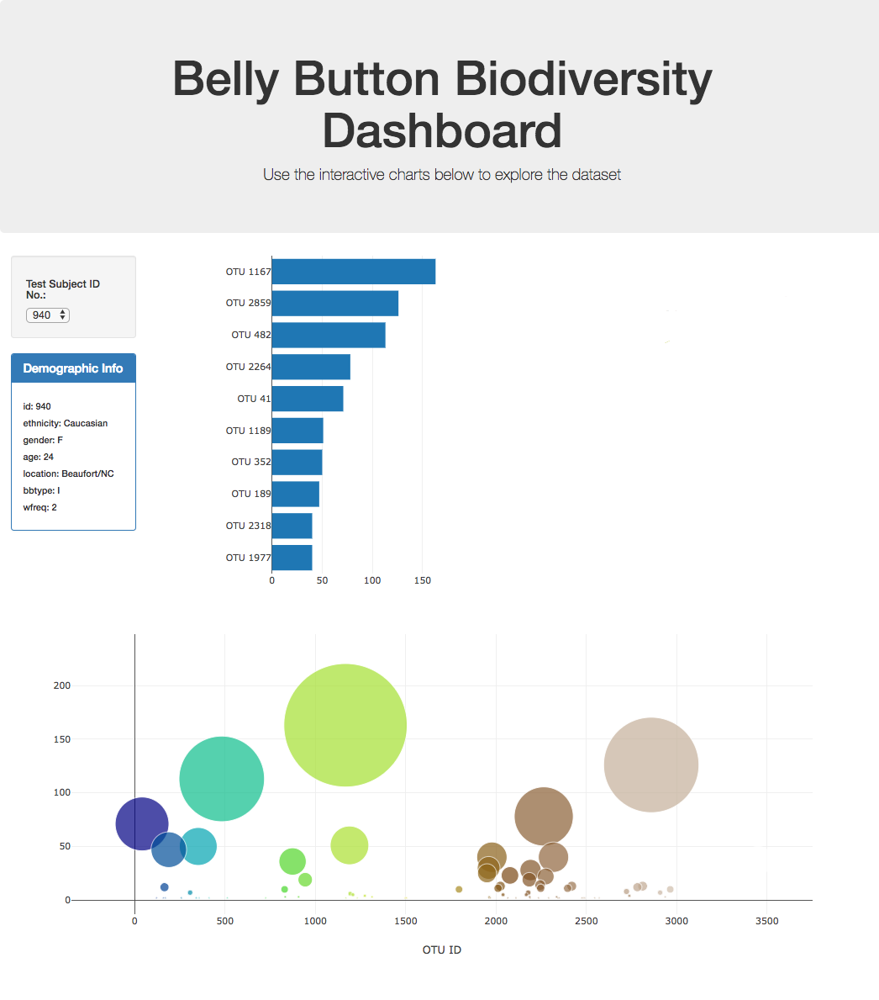

# Belly Button Biodiversity

## Introduction

The aim of this project is to build an interactive dashboard to explore the [Belly Button Biodiversity dataset](http://robdunnlab.com/projects/belly-button-biodiversity/), which catalogs the microbes that colonize human navels.

The dataset reveals that a small handful of microbial species (also called operational taxonomic units, or OTUs, in the study) were present in more than 70% of people, while the rest were relatively rare.

## Technologies

* JavaScript
* D3 Library
* HTML
* JSON

## Dashboard

1. Uses the D3 library to read in the dataset.

2. Creates a horizontal bar chart with a dropdown menu to display the top 10 OTUs found in that individual.

3. Creates a bubble chart that displays each sample.

4. Displays the sample metadata, i.e., an individual's demographic information.

5. Displays each key-value pair from the metadata JSON object.

6. Updates all of the plots any time that a new sample is selected.

